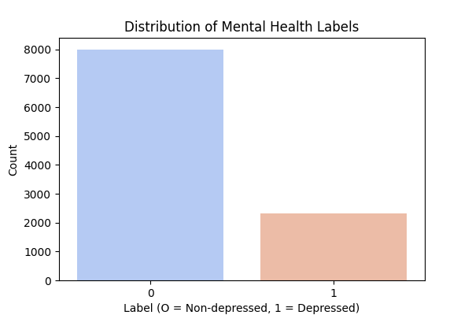
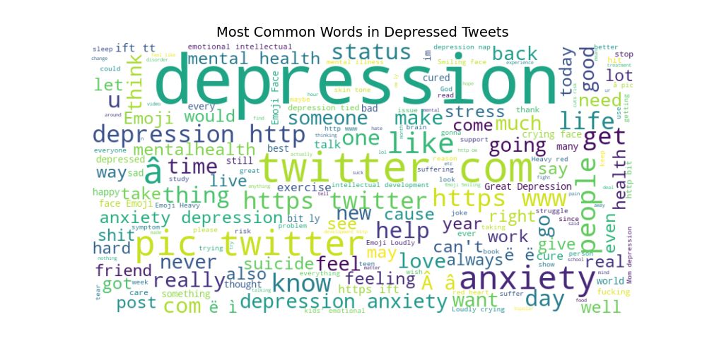
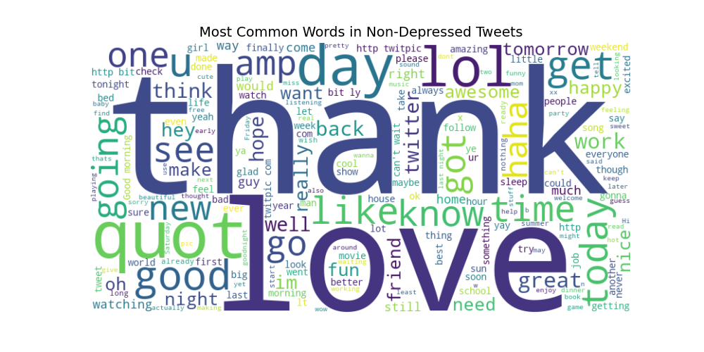
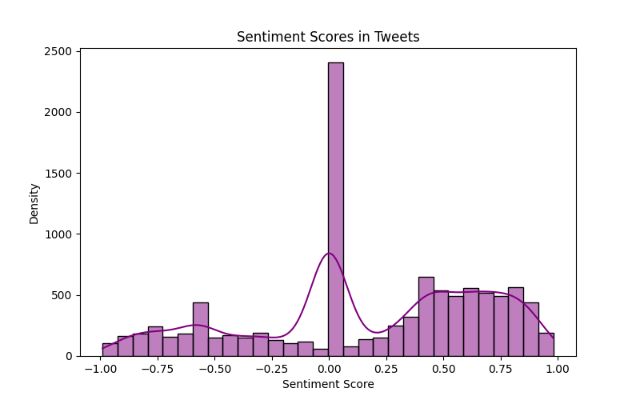
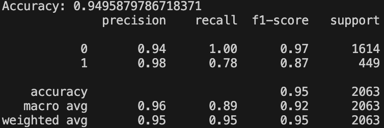

# Mental Health Tweets Analysis

## Objective
Perform exploratory data analysis (EDA) on tweets related to depression to extract insights about mental health discussions on social media.

## Introduction:
Identifying depressive tendencies from an individual's tweets can be critical for someone struggling with a mental health disorder, allowing for early intervention and even prevention of mental health crises. It can provide an opportunity for the individual to seek support and access treatment options before issues escalate.

## Data:
The analysis uses a Kaggle dataset:
https://www.kaggle.com/datasets/gargmanas/sentimental-analysis-for-tweets

The CSV contains over 10,000 entries of tweets labeled:
- 1: Indicative of depression
- 0: Not indicative of depression

The distribution of depressed vs. non-depressed tweets can be seen below:

## Text Analysis:
The following word cloud illustrates the most used words in the depressed tweets:

Key words in the graphic include "depression", "anxiety", and "help", reflecting the negative sentiments in these tweets.

Conversely, the word cloud generated from the non-depressed tweets reflect a more positive tone:

Notable words like "thank" and "love" illustrating a distinct contrast between between the language used in depressed vs. non-depressed tweets.

## Sentiment Analysis

To better understand the tone of tweets associated with depressed, I applied sentiment analysis using the VADER SentimentIntensityAnalyzer. Each tweet was assigned a compound sentiment score, ranging from -1 (most negative) to +1 (most positive). 

The histogram below displays the results:

Here are some key observations:
- A significant portion of tweets have a neutral sentiment score (~0.0), indicating that many tweets may be factual statements or otherwise lacking strong emotions.
  - A large neutral category suggest large quantities of general discussions or less emotionally charged messages.
- Positive tweets span a wide range of scores, extending close to +1.0. This indicates a broad range of strongly positive expressions.
  - A stronger positive skew could indicate more messages that use uplifting and supportive language.
- Conversely, negative tweets do not extend as frequently to -1.0, suggesting most are moderately negative as opposed to extremely.
  - A lack of extremely negative tweets suggests that these tweets reflect general distress more than intense, negative emotions.

 ## Predictive Model

A Naïve Bayes classifier was used to predict whether a tweet would be classified as depress or non-depressed. I extracted features via TF-IDF, with stop words removed and the vocabulary limited to 5000 terms. The dataset was split into 80% training and 20% testing. I then evaluated the model on accuracy, precision, recall, and F1-score.

Here are the scores:

Although the model performed well, the recall for depressed tweets was lower, at 0.78, suggesting missed depressive tweets. Overall, this Naïve Bayes model offers a strong baseline for depression detection in tweets.
